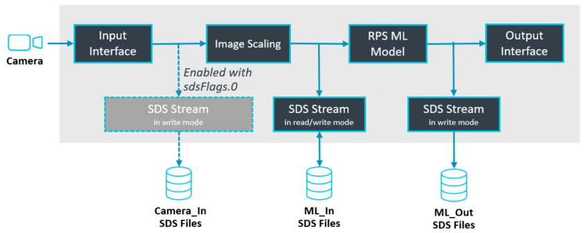
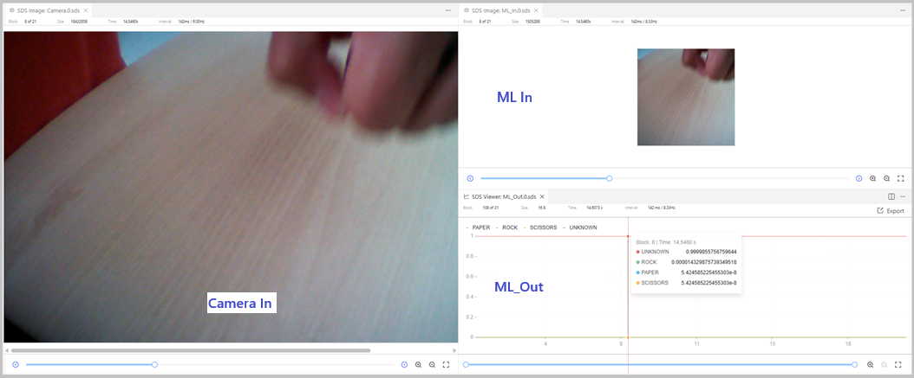
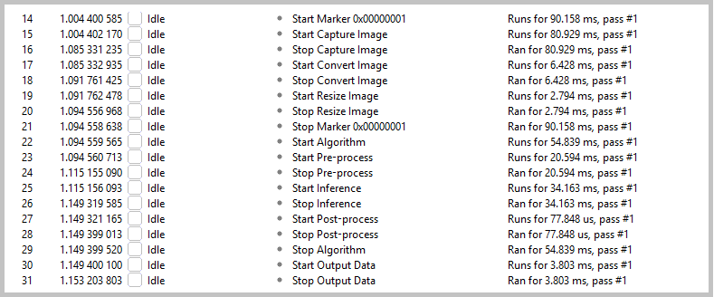
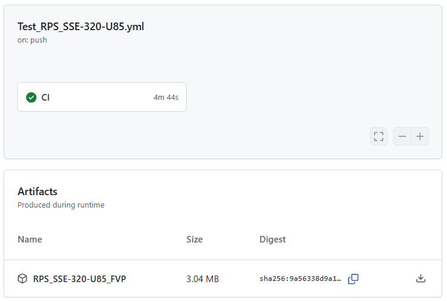
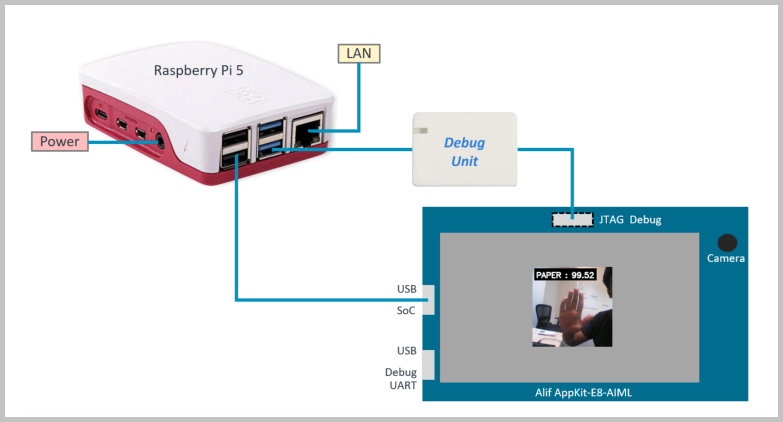
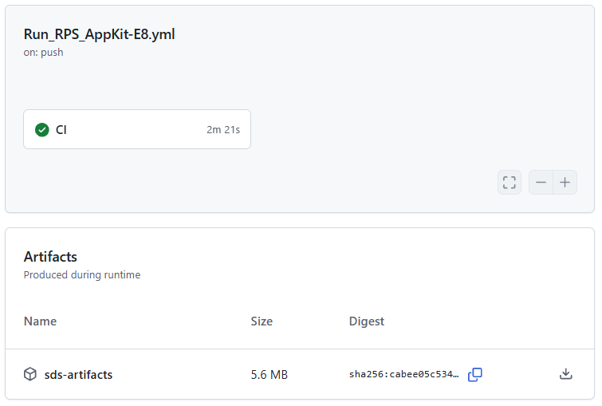

[](https://github.com/Arm-Examples/ModelNova/actions/workflows/Test_RPS_SSE-320-U85.yml)
[](https://github.com/Arm-Examples/ModelNova/actions/workflows/Build_RPS_AppKit-E8.yml)
[](https://github.com/Arm-Examples/ModelNova/actions/workflows/Run_RPS_AppKit-E8.yml)
[](https://github.com/Arm-Examples/ModelNova/actions/workflows/Build_RPS_Variants.yml)

**Work in Progress**


This repository shows how to build **Edge AI applications with Cortex-M/Ethos-U-based microcontrollers**. It uses the [SDS-Framework](https://www.keil.arm.com/packs/sds-arm) for data capturing and testing, [ModelNova - Fusion Studio](https://modelnova.ai/fusion-studio-beta) for AI model development, and [Keil MDK](https://www.keil.arm.com/) for embedded development.

> [!TIP]
> Register for [Webinar 3: Integrating ModelNova Fusion Studio with Arm Keil MDK](https://developer.arm.com/embedded-and-microcontrollers/modelnova-fusion-studio-with-keil-mdk) to learn more.

## Quick Start

The [RockPaperScissors (RPS)](./Documentation/README.md) project implements an AI model that detects [three hand gestures](https://en.wikipedia.org/wiki/Rock_paper_scissors) ([RPS_cls_dataset](./RockPaperScissors/RPS_cls_dataset/) provides test data). The [`AppKit-E8_USB/SDS.csolution.yml`](./RockPaperScissors/AppKit-E8_USB/SDS.csolution.yml) project uses the SDS framework for testing the AI model on the Alif AppKit-E8 hardware or an Arm FVP simulation model.

### Keil MDK

1. Install [Keil Studio for VS Code](https://marketplace.visualstudio.com/items?itemName=Arm.keil-studio-pack) and [Arm SDS for VS Code](https://marketplace.visualstudio.com/items?itemName=Arm.cmsis-sds) from the VS Code marketplace.
2. Clone this repository (for example using [Git in VS Code](https://code.visualstudio.com/docs/sourcecontrol/intro-to-git)) or download the ZIP file. Then open the base folder in VS Code.
3. Open the [CMSIS View](https://mdk-packs.github.io/vscode-cmsis-solution-docs/userinterface.html#2-main-area-of-the-cmsis-view) in VS Code, use *Open Solution in Workspace* (... menu), and choose `RockPaperScissors/AppKit-E8_USB/SDS.csolution.yml` to open the project.
4. The related tools and software packs are downloaded and installed. Review progress with *View - Output - CMSIS Solution*.
5. In the CMSIS view, use the [Action buttons](https://github.com/ARM-software/vscode-cmsis-csolution?tab=readme-ov-file#action-buttons) to build, load, and debug the example to the [target hardware](./Documentation/README.md#target-hardware).

> [!TIP]
> If you are new to Alif devices and boards, start with the `Blink_HP` example project using *Create Solution* with the board `Alif AppKit-E8-AIML`.

## Application

The diagram below illustrates the RPS application architecture. During algorithm development, the [SDS-Framework](https://www.keil.arm.com/packs/sds-arm) supports recording and playback of data streams for analysis and ML model training.



### Development Steps

**Create Classic Embedded Application:**

1. [Create the input interface](./Documentation/README.md#input-interface-and-signal-conditioning), add signal conditioning, and start capturing data for ML model training.
2. [Select an ML model](./Documentation/README.md#create-ml-model), then use the captured data for training, analysis, and creation of the optimized ML model.
3. [Integrate the ML model](./Documentation/README.md#integrate-ml-model) into the SDS framework and analyze performance.

**Test Embedded Application:**

1. [Arm SDS for VS Code](https://marketplace.visualstudio.com/items?itemName=Arm.cmsis-sds) lets you capture the various data streams of the application in [SDS data files](https://arm-software.github.io/SDS-Framework/main/overview.html) for analysis.
    
2. The [SDS.sdsio.yml](./RockPaperScissors/AppKit-E8_USB/SDS.sdsio.yml) configuration file defines `play:` steps for regression testing for example with [Contiguous Integration (CI)](#contiguous-integration-ci)

**Create ML Model:**

1. [Capture new data](./Documentation/README.md#capture-new-data) where the ML model does not deliver the expected results.
2. [Retrain the AI model](./Documentation/README.md#retrain-ai-model) using additional training data to optimize performance.
3. [Add regression testing](./Documentation/README.md#regression-test) before integrating a new AI model into the embedded system.

### ModelNova Fusion Studio

1. Download and install [ModelNova Fusion Studio](https://modelnova.ai/fusion-studio-beta).
2. Launch the application and login to the application using the PAT from the **Get it from here** button

    

3. Click the **New Workspace** button.
4. Choose to create any type of workspace (e.g., from scratch, starter pack, etc.).

    

5. Select the appropriate **Category** and **Domain** for your ML project.

    

6. Enter the workspace to begin your workflow.

    While Fusion Studio supports multiple workspace creation methods (Scratch, Starter Pack, AI Assist), the **ML workflow remains identical for all workspaces**.

## Analyze Timing with SystemView

[SEGGER SystemView](https://www.segger.com/products/development-tools/systemview/) can be used for timing analysis. The application includes annotations that let you measure the timing of different compute blocks, as shown below.



### Capture SystemView Data with J-Link

> [!NOTE]
> This configuration is used for interactive debugging with the on-board J-Link adapter of the AppKit-E8.

- Open `Manage Solution Settings`, select `Target Set: J-Link` and download the application to the AppKit-E8.
- Start the [SystemView tool](https://www.segger.com/downloads/systemview/) on the host computer and:
    - Select Target - Recorder Configuration and use the following settings:
        - SystemView Recorder: J-Link
        - J-Link Connection: USB
        - Target Connection: AE822FA0E5597BS0_M55_HP
        - RTT Control Block Detection: Address of .bss._SEGGER_RTT in linker map file (i.e. 0x02002200)

### Capture SystemView Data with PyOCD

> [!NOTE]
> This configuration is used for CI testing with [Run_RPS_AppKit-E8](./.github/workflows/Run_RPS_AppKit-E8.yml). The relevant RTT and SystemView settings are part of [`AppKit-E8_USB/SDS.csolution.yml`](./RockPaperScissors/AppKit-E8_USB/SDS.csolution.yml). It requires a CMSIS-DAP debug adapter that is connected to the JTAG port of the AppKit-E8.

- Open `Manage Solution Settings`, select `Target Set: HIL` and download the application to the AppKit-E8.
- Start the pyOCD Run task (Terminal - Run Task... - pyOCD Run). You may terminate pyOCD using the keyboard. This should generate the following output:

```txt
  0002041 W Skipping CoreSight discovery for AHB5-AP@0x40000 because it is disabled [ap]
  0002223 I RTT channel 1 configuration for core 0: mode=systemview-server, port=19021 [rtt_manager]
  0002223 W RTT for core 1: no channels configured; RTT disabled [rtt_manager]
  0002226 I Run server started for M55_HP (core 0); STDIO mode: console; RTT: enabled [run_cmd]
  0002227 I Run server started for M55_HE (core 1); STDIO mode: off; RTT: disabled [run_cmd]
  0002231 E Error writing RTT down channel 1: SWD/JTAG communication failure (WAIT ACK) [rtt_server]
  0002245 W Target core 1 unexpectedly halted at pc=0x00000ed2 [run_cmd]
  0043783 I KeyboardInterrupt received; shutting down Run servers [run_cmd]
```

The `pyOCD run` command captures the file `./out/SDS+AppKit-E8-U85.SVDat`. Open that file with the SystemView application on the host computer to view the recording.

## Continuous Integration (CI)

This repository uses the [CI workflows](https://github.com/Arm-Examples/.github/blob/main/profile/CICD.md) listed below to build artifacts and verify projects. Examples are verified with the Keil Studio build system, which uses CMSIS-Toolbox and CMake. This toolchain supports CI by:

- Installing tools from a single [vcpkg-configuration.json](./vcpkg-configuration.json) file for desktop and CI environments.
- Using CMSIS solution files (`*.csolution.yml`) to enable seamless builds in CI, for example with GitHub Actions.

[GitHub Action](./actions)                                                        | Description
:--------------------------------------------------------------------|:---------------------------------------
[Test_RPS_SSE-320-U85.yml](./.github/workflows/Test_RPS_SSE-320-U85.yml) | Build and run image with SDS data input on FVP simulation model
[Build_RPS_AppKit-E8.yml](./.github/workflows/Build_RPS_AppKit-E8.yml)   | Build image with SystemView enabled for testing on [target hardware](./Documentation/README.md#target-hardware).
[Run_RPS_AppKit-E8.yml](./.github/workflows/Run_RPS_AppKit-E8.yml)       | Run image on hardware with SDSIO-Server and SystemView for timing analysis
[Build_Variants.yml](./.github/workflows/Build_Variants.yml)             | Ensure that everything builds; Build the different context variants: `project.build-type+target-type`

### Build and Run Image on FVP Simulation Model

The action [Test_RPS_SSE-320-U85.yml](./.github/workflows/Test_RPS_SSE-320-U85.yml) builds and executes the application on the FVP simulation model. The same commands can be executed in the IDE by selecting the target type `SSE-320-U85` in the Manage Solution dialog (which uses a simulation model compatible with the AppKit-E8).

The action executes the following commands to build and test the application.

```cmd
>cbuild SDS.csolution.yml --active SSE-320-U85 --packs
>
>FVP_Corstone_SSE-320 -f ./Board/Corstone-320/fvp_config.txt -a ./out/AlgorithmTest/SSE-320-U85/Debug/AlgorithmTest.axf --simlimit 120
```

> [!TIP]
> You can clone the repository and run the workflow and examine the test results in detail.

The picture below shows the output of the [Test_RPS_SSE-320-U85.yml action](./actions/workflows/Test_RPS_SSE-320-U85.yml). The artifacts file `RPS_SSE-320-U85_FVP` contains the `out` directory with the generated image and new `SDS recordings` captured during playback (`*.p.sds` files) along with the simulation log file (`sdsio.log`).



### Build and Run Image on Target Hardware

The [Build_RPS_AppKit-E8.yml](./.github/workflows/Build_RPS_AppKit-E8.yml) workflow executes on a GitHub-hosted runner and generates the image with SystemView enabled for testing on [target hardware](./Documentation/README.md#target-hardware). Once generated, the image is stored as the artifact `RPS_AppKit-E8-U85_HIL`, which is then downloaded by [Run_RPS_AppKit-E8.yml](./.github/workflows/Run_RPS_AppKit-E8.yml).

The [Run_RPS_AppKit-E8.yml](./.github/workflows/Run_RPS_AppKit-E8.yml) workflow executes on a Raspberry Pi (RPi). It therefore requires [setting up and configuring a self-hosted GitHub Runner on Raspberry Pi 5](https://github.com/Arm-Examples/.github/blob/main/profile/RPI_GH_Runner.md). The AppKit-E8 is connected to the RPi as shown below.



The [Run_RPS_AppKit-E8.yml](./.github/workflows/Run_RPS_AppKit-E8.yml) workflow is triggered when [Build_RPS_AppKit-E8.yml](./.github/workflows/Build_RPS_AppKit-E8.yml) stores a new `RPS_AppKit-E8-U85_HIL` artifact. pyOCD connects through a CMSIS-DAP debug unit to download and execute the image on the AppKit-E8. During execution, pyOCD captures RTT `printf` output and the SystemView data file. The SDSIO-Server (also running on the RPi) uses the configuration file `SDS.sdsio.yml`. The `play:` node defines the SDS data files that are streamed for playback and recording.

Once the test completes, the RTT output and SystemView data file (captured with pyOCD), and the recorded SDS data files with extension `.p.sds` (captured with SDSIO-Server), are uploaded as artifacts.

The picture below shows the output of the [Run_RPS_AppKit-E8.yml action](./.actions/workflows/Run_RPS_AppKit-E8.yml). The artifact `RPS_AppKit-E8-U85_HIL` contains the generated image, and the run uploads the log file `sdsio-server.log` together with new `SDS recordings` captured during playback (`*.p.sds` files).



## Issues or Questions

Use the [**Issues**](./issues) tab to raise questions or issues.
